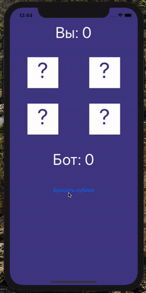
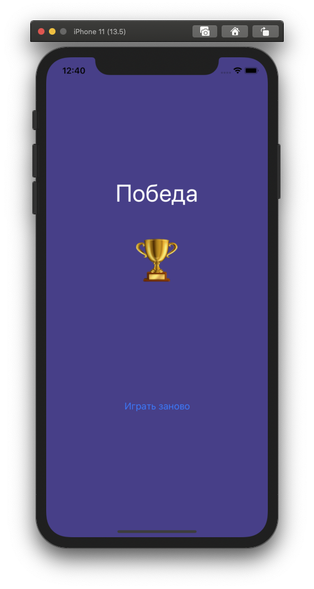
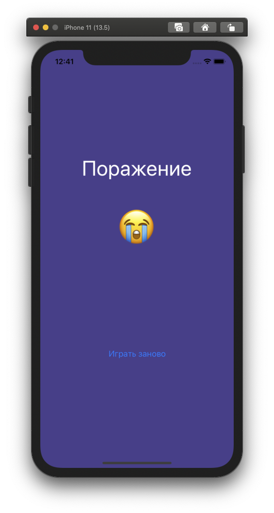
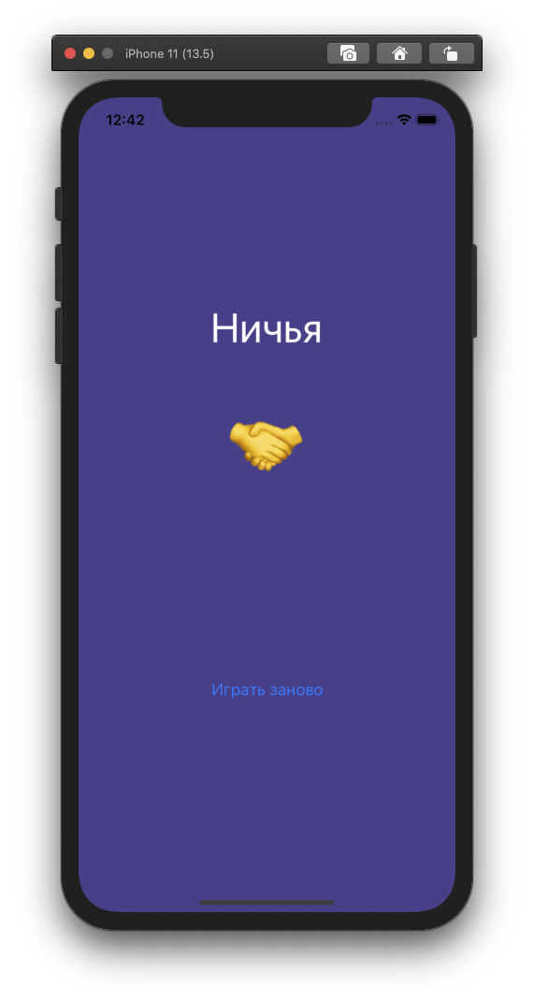

# Инструкция

1. npm install
2. npm install --global expo-cli
3. expo start
4. Как запустить приложение:

   - Открыть эмулятор Android/IOS и запустить приложение через левое боковое
     окно на странице http://localhost:19002/
   - Скачать приложение "Expo" на смартфон и просканировать QR-код на сайте
     http://localhost:19002/

# Демо

# Экран "Победа"

# Экран "Поражение"

# Экран "Ничья"

